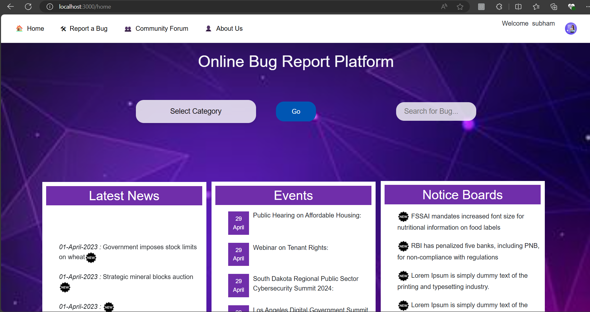

# Citizen-Driven Bug Reporting and Monitoring Platform

## Description
A comprehensive system that enables citizens to report bugs on government websites, fosters a community of like-minded individuals dedicated to improving these platforms, and provides higher authorities like the Prime Minister, Chief Ministers, and the President with tools to monitor and ensure the proper functioning of these websites.

## Problem Statement
Develop a system to allow citizens to report bugs on government websites, create a community forum for discussion, provide login functionality for users and authorities, and offer a monitoring dashboard for authorities to oversee the status and resolution of reported bugs.



## Features
- **Bug Reporting**: Users can report bugs they encounter on government websites.
- **View Bugs by Department**: Users can view reported bugs from different government departments.
- **Comment on Bugs**: Users can comment on reported bugs to provide additional information or suggestions.
- **Community Forum**: A platform for users to discuss and share insights about reported bugs.
- **User Login**: Secure login functionality for users to report and track bugs.
- **Authority Login**: Separate login for authorities with access to monitoring tools.
- **Monitoring Dashboard**: Real-time monitoring dashboard for authorities to oversee bug reports and their resolution status.

## Technologies Used
- **Frontend**: HTML, CSS, Bootstrap
- **Backend**: Node.js, Express
- **Template Engine**: EJS
- **Database**: MySQL

## Run Locally
1. Clone the repository:
    ```bash
    git clone https://github.com/your-username/your-repository-name.git
    cd your-repository-name
    ```

2. Install dependencies:
    ```bash
    npm install mysql body-parser path express express-session multer ejs http
    ```

    This will install the following dependencies:
    - `mysql`: Node.js driver for MySQL.
    - `body-parser`: Middleware to handle JSON, Raw, Text, and URL-encoded form data.
    - `path`: Utility to work with file and directory paths.
    - `express`: Web framework for Node.js.
    - `express-session`: Middleware for managing sessions.
    - `multer`: Middleware for handling `multipart/form-data`, used for file uploads.
    - `ejs`: Templating engine for rendering HTML templates.
    - `http`: Core module for creating HTTP servers and clients.

3. Set up the database:

    ### Bugs Table
    - Table: `bugs`
    - Description: Stores information about reported bugs
    ```sql
    CREATE TABLE `bugs` (
      `email` text NOT NULL,
      `title` text NOT NULL,
      `category` text NOT NULL,
      `ministry` text NOT NULL,
      `descr` longtext NOT NULL,
      `webname` text NOT NULL,
      `weblink` longtext NOT NULL,
      `img` blob NOT NULL,
      `img2` blob NOT NULL,
      `date` timestamp NOT NULL DEFAULT current_timestamp(),
      `status` text NOT NULL DEFAULT 'pending'
    ) ENGINE=InnoDB DEFAULT CHARSET=utf8mb4 COLLATE=utf8mb4_general_ci;
    ```

    ### Users Table
    - Table: `user`
    - Description: Stores information about registered users
    ```sql
    CREATE TABLE `user` (
      `username` text NOT NULL,
      `email` text NOT NULL,
      `mobile` int(11) NOT NULL,
      `password` text NOT NULL,
      `credit` int(11) NOT NULL DEFAULT 0,
      `autho` text NOT NULL DEFAULT 'false'
    ) ENGINE=InnoDB DEFAULT CHARSET=utf8mb4 COLLATE=utf8mb4_general_ci;
    ```

    ### Comments Table
    - Table: `comm2`
    - Description: Stores comments on bug reports
    ```sql
    CREATE TABLE `comm2` (
      `title` text NOT NULL,
      `username` text NOT NULL,
      `comm` longtext NOT NULL
    ) ENGINE=InnoDB DEFAULT CHARSET=utf8mb4 COLLATE=utf8mb4_general_ci;
    ```

    ### Departments Table
    - Table: `departments`
    - Description: Stores information about government departments
    ```sql
    CREATE TABLE `departments` (
      `id` int(11) NOT NULL,
      `name` varchar(100) NOT NULL COMMENT 'Name of the department',
      `description` text COMMENT 'Description of the department',
      PRIMARY KEY (`id`)
    ) ENGINE=InnoDB DEFAULT CHARSET=utf8mb4 COMMENT='Table to store government departments';
    ```

    ### Authority Table
    - Table: `authority`
    - Description: Stores information about authorities
    ```sql
    CREATE TABLE `authority` (
      `id` int(11) NOT NULL,
      `username` text NOT NULL,
      `email` text NOT NULL,
      `mobile` int(11) NOT NULL,
      `password` text NOT NULL,
      `department` text NOT NULL,
      `autho` text NOT NULL DEFAULT 'true'
    ) ENGINE=InnoDB DEFAULT CHARSET=utf8mb4 COLLATE=utf8mb4_general_ci;
    ```

4. Update the database configuration in the project. Edit the `app.js` (or equivalent configuration file) and set your database host, name, user, and password:
    ```javascript
    // app.js
    var con = mysql.createConnection({
        host: "your-server",
        user: "your-username",
        password: "your-password",
        database: "your-database",
    });
    ```

5. Start the application:
    ```bash
    npm start
    ```

## Usage
- Access the application at `http://localhost:3000`.
- Register as a user to report bugs.
- View bugs reported by department and comment on them.
- Authorities can log in to access the monitoring dashboard.

# Project Contributors

We developed this project together:

| Contributor | Profile |
|-------------|---------|
|**Varma** |https://github.com/varma-101 |
| **Hafiza** | https://github.com/ShaikHafiza |

Feel free to check out our profiles and follow our work!


All contributors have equal ownership and contributions to the project.
